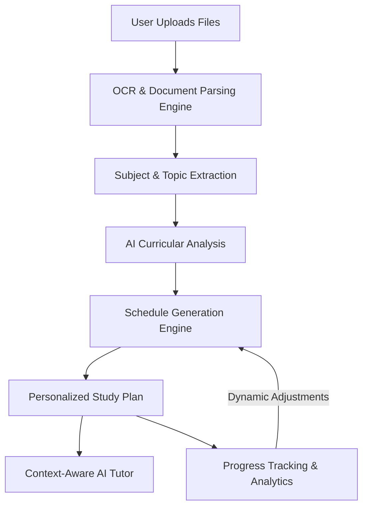
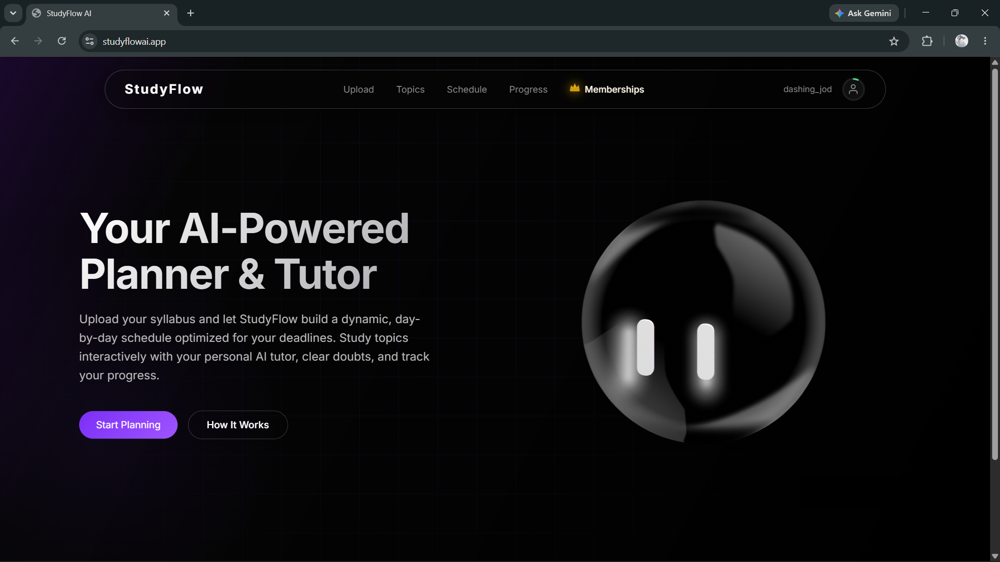
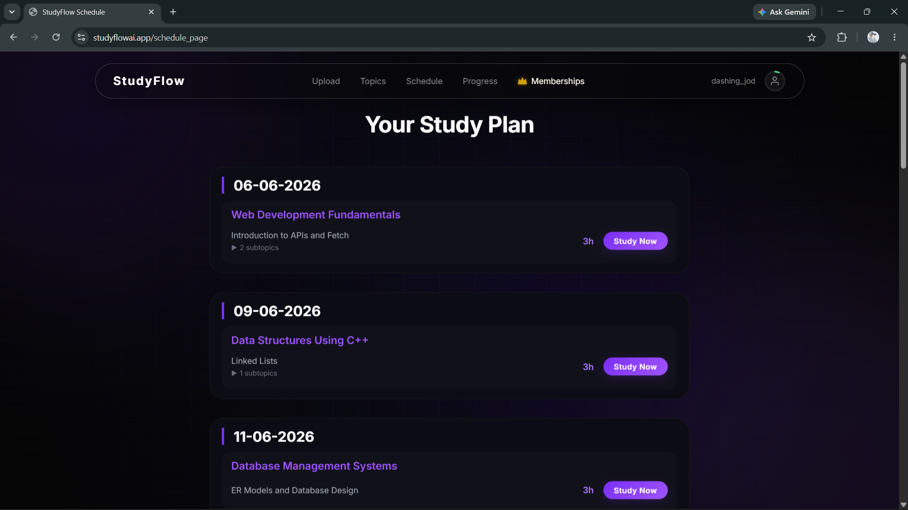
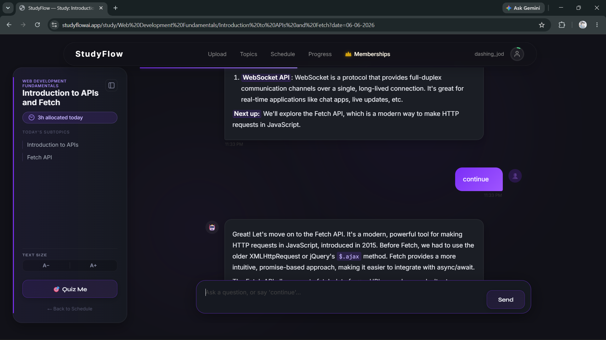
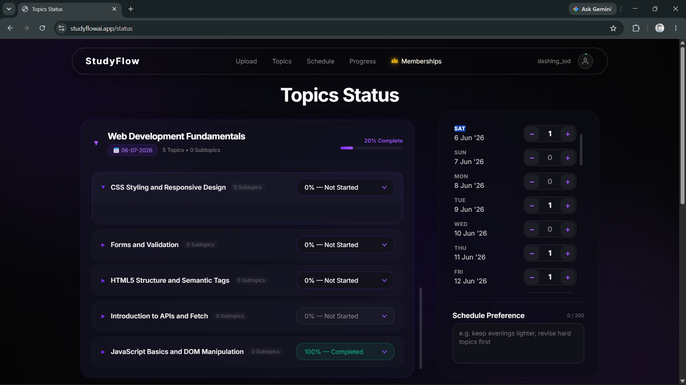
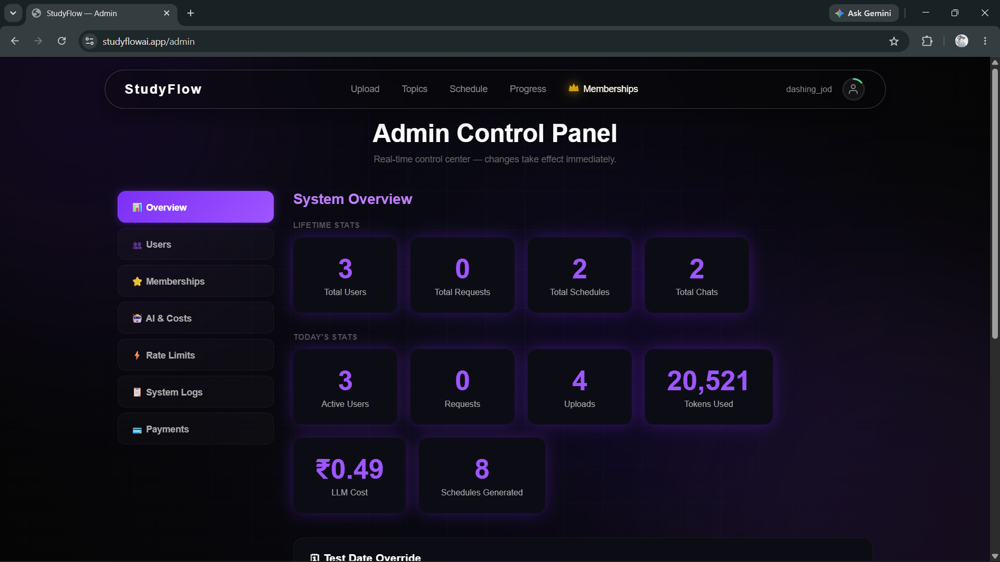
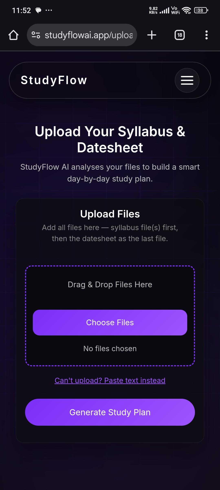
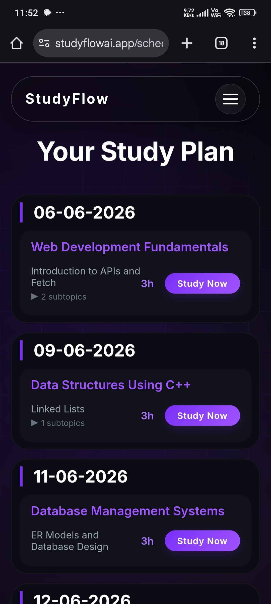

# ⚡ StudyFlow AI

[](https://studyflowai.app)
[](https://opensource.org/licenses/MIT)
[](https://www.python.org/)
[](https://flask.palletsprojects.com/)
[](https://github.com/PaddlePaddle/PaddleOCR)

> **StudyFlow AI** is an intelligent study planner and personal tutoring platform designed to convert complex syllabi and datesheets into highly optimized, day-by-day learning schedules. 

By utilizing advanced OCR pipeline and LLM processing, the application extracts curriculum topics, deadlines, and dates to automatically generate structured roadmaps and provide an interactive AI-powered tutor for every study topic.

---

## ✨ Key Highlights

* **Automated Schedule Generation** – Custom AI-generated timelines built around your exam schedules and available daily study hours.
* **Personalized AI Tutor** – Context-aware conversational tutor for every generated topic in your roadmap.
* **Robust OCR Integration** – Automated text extraction from scanned document PDFs and datesheet images.
* **Multi-Format Parsing** – Direct support for PDF, Word documents, spread sheets, presentation decks, and standard image files.
* **Interactive Progress Tracking** – Dynamic learning analytics and real-time schedule re-balancing based on completion status.
* **Premium Billing Core** – Secure membership tier upgrades integrated with Razorpay.
* **Granular Admin Control** – Comprehensive analytics dashboard for monitoring user activity, API usage tokens, and hosting cost details.

---

## 🏗️ System Architecture

The following diagram illustrates how user-uploaded files flow through the StudyFlow AI extraction, planning, and interactive execution engines.



---

## 🛠️ Supported File Formats

StudyFlow AI processes multiple curriculum documents concurrently. The final file uploaded must be the examination datesheet to anchor the scheduling timeline.

| File Type | Extensions | Purpose |
|:---|:---|:---|
| **Documents** | `.pdf`, `.docx`, `.txt` | Syllabus files, textbooks, or course guides |
| **Images** | `.png`, `.jpg`, `.jpeg`, `.webp` | Datesheet pictures, schedules, or handwritten syllabi |
| **Data & Presentations** | `.xlsx`, `.ppt`, `.pptx` | Tabular schedules or lesson slide decks |

---

## 🎨 Screenshots

StudyFlow AI features a responsive user experience styled with custom glassmorphic styling optimized across desktop, tablet, and mobile platforms.

### Desktop Experience

#### Landing Page


#### Study Schedule


#### AI Tutor


#### Progress Tracking


#### Admin Dashboard


---

### Mobile Experience

| Upload Page | Mobile Schedule |
| :---: | :---: |
|  |  |

---

## ⚙️ Tech Stack

### Frontend & UI
* **Core Languages:** HTML5, CSS3 (Custom responsive styling), JavaScript (ES6+)
* **Interactive Components:** Dynamic status triggers, conversational chat interface

### Backend & API
* **Application Framework:** Python / Flask
* **Database Layer:** SQLite with SQLAlchemy ORM
* **Task Pipelines:** Multi-threaded OCR and file processing

### AI & OCR Pipeline
* **LLM Engine:** OpenRouter AI API (`qwen/qwen2.5-72b-instruct`, `qwen/qwen3-vl-235b-a22b-thinking`)
* **Text Extraction:** PaddleOCR, `pdf2image`, PyPDF, `python-docx`

### Infrastructure & Integrations
* **Payments:** Razorpay Subscription Integration
* **Authentication:** Google OAuth 2.0 / Email OTP
* **Email System:** Resend SMTP Services
* **Deployment & Domain:** Render / Name.com

---

## 📂 Project Structure

```bash
studyflow-ai/
├── backend/
│   ├── admin_bp.py             # Admin panel control flow & analytics API
│   ├── api_bp.py               # Core application endpoints (Schedules, topics, progress)
│   ├── auth_bp.py              # User authentication (Google OAuth, OTP validations)
│   ├── chat_bp.py              # AI Tutor conversational chat router
│   ├── pages_bp.py             # Main frontend page routes
│   └── razor.py                # Razorpay transactions and billing client
├── database/
│   ├── models.py               # Database schemas (Users, Schedules, Progress, Logs)
│   └── instance/
│       └── studyflow.db        # Local SQLite database
├── ocr/
│   ├── text_extractor.py       # Core PaddleOCR, DOCX, and PDF text parsers
│   └── extractors/             # File-specific parsing strategies
├── ai/
│   ├── schedule_planner.py     # AI logic for date mapping and topic allocation
│   ├── teacher.py              # Context-aware tutoring agent engine
│   └── llm/                    # OpenRouter API configurations and prompt strategies
├── payments/
│   └── templates/              # Checkout modals and payment status pages
├── authentication/
│   └── helpers.py              # Password hashing, salting, and JWT tokens helper utilities
├── static/                     # Global static assets
│   ├── css/                    # Modular layout styles (glassmorphism UI variables)
│   └── js/                     # Event handlers for schedules, upload pipelines, and chat
├── templates/                  # Frontend markup views
│   ├── Upload-page.html        # Drag-and-drop syllabus portal
│   ├── Status.html             # Progress monitor and metrics page
│   └── Schedule.html           # Interactive Study Roadmap dashboard
├── app.py                      # Flask core gateway entrypoint
├── config.py                   # System environment configurations
├── extensions.py               # Database, Mail, and Session global initialization instances
├── requirements.txt            # Python dependencies manifest
└── README.md                   # Repository documentation
```

---

## 🚀 Installation & Local Setup

Follow these steps to set up and run a local instance of StudyFlow AI.

### 1. Clone the Repository
```bash
git clone <repository-url>
cd studyflow-ai
```

### 2. Create and Activate Virtual Environment
```bash
# Create environment
python -m venv venv

# Activate on Windows
venv\Scripts\activate

# Activate on macOS/Linux
source venv/bin/activate
```

### 3. Install Required Dependencies
```bash
pip install -r requirements.txt
```

---

## 🔒 Environment Configuration

Create a `.env` file in the root directory and define the following variables:

```env
# AI Model & OpenRouter Configs
AICREDITS_API_KEY=your_openrouter_api_key

# Google Authentication Keys
GOOGLE_CLIENT_ID=your_google_client_id
GOOGLE_CLIENT_SECRET=your_google_client_secret

# Payments Integration
RAZORPAY_KEY_ID=your_razorpay_key_id
RAZORPAY_KEY_SECRET=your_razorpay_key_secret

# Email Dispatch Services
RESEND_API_KEY=your_resend_api_key

# Server Settings
SECRET_KEY=your_flask_session_secret_key
SMTP_FROM_EMAIL=no-reply@studyflowai.app
SMTP_FROM_NAME=StudyFlow AI
```

### Configuration Directory Details

* `AICREDITS_API_KEY`: Used to query OpenRouter model completion endpoints.
* `GOOGLE_CLIENT_ID` / `GOOGLE_CLIENT_SECRET`: Handles identity verification and secure single sign-on logic.
* `RAZORPAY_KEY_ID` / `RAZORPAY_KEY_SECRET`: Configures transaction callbacks and verifies subscription signatures.
* `RESEND_API_KEY`: Leveraged for high-reliability dispatch of security OTP emails.
* `SECRET_KEY`: Signs session cookies and keeps application state tamper-proof.
* `SMTP_FROM_EMAIL` / `SMTP_FROM_NAME`: Defines metadata parameters for emails sent to users.

---

## 🏃 Running Locally

Once configured, boot the local development server:

```bash
python app.py
```

By default, the server listens for traffic at:
```text
http://localhost:5000
```

---

## 👥 Contributors

StudyFlow AI is designed, developed, and maintained by:

| Contributor | Role | Core Focus Areas |
| :--- | :--- | :--- |
| **Manish Rai**<br>[@realmanishrai](https://github.com/realmanishrai) | **Backend Engineer** | Backend Framework, AI Tutor Engines, OCR Pipeline, DB Schemas, Authentication Systems, Checkout, Infrastructure & Deployment |
| **Ayush Sharma**<br>[@sharma-ayush-dev](https://github.com/sharma-ayush-dev) | **Frontend Designer** | UI/UX Prototyping, Glassmorphic CSS Styling, Responsive Design, User-Flow & Interface Development |

---

## 🤝 Acknowledgements

* **OpenRouter** – Providing low-latency interfaces for state-of-the-art LLMs.
* **PaddleOCR** – Enabling lightning-fast character recognition across images.
* **Flask** – Powering our modular backend routing structure.
* **Razorpay** – Seamlessly handling global credit/debit subscriptions.
* **Resend** – Reliable transaction and security email logistics.
* **Render** – Seamless cloud deployment hosting environment.
